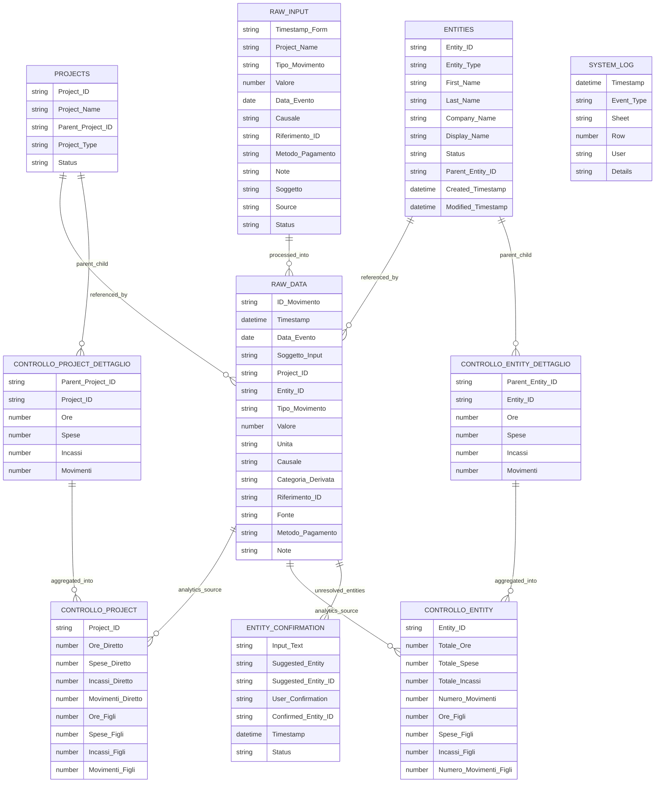

# LOGOS MASTER DOCUMENT
Generated: 03/18/2026 15:30:15

==== FILE: docs\LOGOS_SPEC.md ====
############################################################
LOGOS — SYSTEM SPECIFICATION
File: LOGOS_SPEC.md
System: LOGOS Engine
Ecosystem: AIOS
Document Type: System Specification
Status: Consolidated Draft
############################################################

Prefazione
Il presente documento definisce la specifica concettuale ufficiale del sistema LOGOS.
LOGOS è un motore di gestione eventi e ledger universale progettato per supportare
contabilità operativa, gestione progetti, tracciamento del tempo, monitoraggio attività
e analisi KPI tramite una pipeline eventi strutturata.

Il sistema è progettato come template universale destinato a generare istanze operative
indipendenti. Esempi di istanze previste includono:
- LOGOS_ADEXIMA
- LOGOS_ASPRI
- LOGOS_MAURIZIOLAB

Ogni istanza mantiene completa separazione dei dati.

Indice
1 Scopo del sistema
2 Principi architetturali
3 Modello concettuale
4 Tipologie di evento
5 Pipeline di ingestione
6 Event Ledger
7 Dimension Tables
8 Modello temporale
9 Analytics Layer
10 Modello di istanza
11 Compatibilità tecnologica
12 Vincoli architetturali
13 Estensioni previste
14 Note di versionamento

1 — Scopo del sistema
LOGOS è un Event Processing Engine progettato per registrare, processare e analizzare
eventi operativi all'interno di sistemi organizzativi complessi.

Gli eventi possono rappresentare:
- attività operative
- tempo di lavoro
- spese
- incassi
- eventi organizzativi

Gli eventi sono trasformati in record standardizzati all'interno di un ledger append-only.

2 — Principi architetturali
Event-driven architecture
Ogni operazione registrata nel sistema è trattata come evento.

Append-only ledger
Gli eventi non vengono modificati né cancellati; eventuali correzioni avvengono tramite
nuovi eventi che mantengono la cronologia completa.

Separazione input / ledger
Gli input operativi vengono prima inseriti nella coda RAW_INPUT e successivamente
processati dal motore LOGOS_PROCESSOR.

Dimension tables separate
Le dimensioni organizzative sono gestite tramite tabelle dedicate:
PROJECTS e ENTITIES.

3 — Modello concettuale
Oggetti fondamentali del sistema:
EVENT
ENTITY
PROJECT

Relazioni:
EVENT → Entity_ID
EVENT → Project_ID

Le dimensioni ENTITY e PROJECT sono indipendenti e supportano gerarchie parent-child.

4 — Tipologie di evento
Campo: Tipo_Movimento

Valori supportati:
Tempo
Spesa
Incasso
Evento

Evento rappresenta eventi operativi generici come meeting, milestone,
deploy o task non necessariamente economici.

5 — Pipeline di ingestione eventi
INPUT
↓
RAW_INPUT
↓
LOGOS_PROCESSOR
↓
RAW_DATA
↓
DATASET ANALITICI
↓
DASHBOARD

6 — Event Ledger
Ledger principale: RAW_DATA

Campi principali:
ID_Movimento
Timestamp
Data_Evento
Soggetto_Input
Project_ID
Entity_ID
Tipo_Movimento
Valore
Unità
Causale
Categoria_Derivata
Riferimento_ID
Fonte
Metodo_Pagamento
Note

7 — Dimension Tables
PROJECTS
ENTITIES

Entrambe supportano strutture gerarchiche.

8 — Modello temporale
LOGOS utilizza due assi temporali:
Timestamp → tempo di registrazione nel sistema
Data_Evento → tempo reale dell'evento

9 — Analytics Layer
Dataset principali:
CONTROLLO_PROJECT
CONTROLLO_ENTITY

Dataset di dettaglio:
CONTROLLO_PROJECT_DETTAGLIO
CONTROLLO_ENTITY_DETTAGLIO

10 — Modello di istanza
LOGOS è progettato come template engine per generare istanze indipendenti.

11 — Compatibilità tecnologica
Google Sheets + Apps Script
Database SQL
Baserow

12 — Vincoli architetturali
ledger append-only
event-driven ingestion
separazione input / ledger
dimension tables separate

13 — Estensioni previste
API ingestion layer
dashboard avanzate
integrazione SQL
aggregazione multi-istanza

14 — Note di versionamento
Documento generato tramite protocollo CQD e allineato al motore LOGOS
attualmente implementato.

==== FILE: docs\LOGOS_ARCHITECTURE.md ====
############################################################
LOGOS — SYSTEM ARCHITECTURE
File: LOGOS_ARCHITECTURE.md
System: LOGOS Engine
Ecosystem: AIOS
Document Type: Architecture Specification
Status: Consolidated Draft
############################################################

Prefazione
Questo documento descrive l'architettura del sistema LOGOS.
L'obiettivo è definire la struttura operativa del motore,
i livelli logici del sistema e le interazioni tra i componenti.

Il documento rappresenta l'allineamento tra il modello
concettuale definito nello SPEC e l'implementazione reale
del motore LOGOS.

Indice
1 Visione architetturale
2 Strati del sistema
3 Event ingestion pipeline
4 Event processing
5 Ledger layer
6 Dimension layer
7 Analytics layer
8 Runtime Google Stack
9 Evoluzione SQL / Baserow
10 Vincoli architetturali
11 Scalabilità
12 Note di versionamento

1 — Visione architetturale
LOGOS è progettato come Event Processing Engine
basato su un ledger append-only.

L'architettura generale del sistema è:

INPUT
↓
RAW_INPUT (event queue)
↓
PROCESSOR
↓
RAW_DATA (event ledger)
↓
DATASET ANALITICI
↓
DASHBOARD

Questa architettura consente separazione tra:
- ingestione dati
- processing
- storage eventi
- analisi

2 — Strati del sistema

INPUT LAYER
Raccoglie eventi provenienti da:
Form
API
Import dati
Input manuale

INGESTION LAYER
Gestisce la coda eventi tramite il foglio:

RAW_INPUT

PROCESSING LAYER
Il motore LOGOS_PROCESSOR valida e trasforma
gli eventi inseriti nella coda.

LEDGER LAYER
Gli eventi validati vengono scritti nel ledger:

RAW_DATA

ANALYTICS LAYER
Dataset aggregati derivati dal ledger.

VISUALIZATION LAYER
Dashboard e indicatori KPI.

3 — Event ingestion pipeline

Pipeline operativa:

INPUT
↓
RAW_INPUT
↓
Processor
↓
RAW_DATA

RAW_INPUT rappresenta la coda degli eventi
non ancora processati.

4 — Event processing

Il processor esegue le seguenti operazioni:

validazione progetto
risoluzione entità
normalizzazione input
generazione ID movimento
scrittura evento nel ledger

Il processor lavora su batch limitati
per garantire stabilità su Google Apps Script.

5 — Ledger layer

Il ledger principale è:

RAW_DATA

Il ledger segue il principio append-only.

Gli eventi non vengono modificati
né cancellati.

Le correzioni vengono registrate tramite
nuovi eventi.

6 — Dimension layer

Due tabelle dimensionali principali:

PROJECTS
ENTITIES

Entrambe supportano gerarchie parent-child.

Le dimensioni consentono aggregazioni
e analisi multidimensionali.

7 — Analytics layer

Dataset principali:

CONTROLLO_PROJECT
CONTROLLO_ENTITY

Dataset di dettaglio:

CONTROLLO_PROJECT_DETTAGLIO
CONTROLLO_ENTITY_DETTAGLIO

Questi dataset calcolano KPI come:

ore lavorate
spese
incassi
margine
numero eventi

8 — Runtime Google Stack

Implementazione attuale del sistema.

Google Sheets
+
Apps Script

Il processor viene attivato tramite:

onEdit trigger

Flusso operativo:

onEdit
↓
LOGOS_inputTrigger
↓
processRawInputV2

Nota:
questa modalità è considerata temporanea
ed è adottata nella fase prototipale.

9 — Evoluzione SQL / Baserow

In ambienti database il sistema potrà evolvere
verso un modello worker-based.

Architettura prevista:

Event Queue
↓
Worker Processor
↓
Event Ledger
↓
Analytics Engine

Questa architettura consente maggiore
scalabilità e gestione di volumi elevati.

10 — Vincoli architetturali

Il sistema deve rispettare:

ledger append-only
separazione input / ledger
dimension tables separate
pipeline event-driven

11 — Scalabilità

Il sistema su Google Sheets è progettato
per gestire fino a decine di migliaia di eventi.

Per volumi superiori è prevista la migrazione
verso database SQL.

12 — Note di versionamento

Documento generato tramite protocollo CQD.

Allineato con:

LOGOS_SPEC.md
implementazione kernel Apps Script
processor pipeline LOGOS.

==== FILE: docs\LOGOS_SYSTEM_MAP.md ====
############################################################
LOGOS — SYSTEM MAP
File: LOGOS_SYSTEM_MAP.md
System: LOGOS Engine
Ecosystem: AIOS
Document Type: System Map
Status: Consolidated
############################################################

Prefazione
Questo documento rappresenta la mappa sistemica del motore LOGOS.
Lo scopo è fornire una visione sintetica ma completa della struttura
del sistema, dei suoi componenti principali e delle relazioni tra di essi.

La System Map è pensata come documento di orientamento rapido:
un nuovo sviluppatore deve poter comprendere il funzionamento
complessivo di LOGOS leggendo questo documento.

Indice
1 Visione generale
2 Componenti del sistema
3 Pipeline eventi
4 Struttura dati
5 Motore operativo
6 Layer analitico
7 Stack tecnologico
8 Modello di istanza
9 Evoluzioni previste
10 Note di versionamento

1 — Visione generale

LOGOS è un Event Processing Engine basato su ledger.

Struttura logica:

INPUT
↓
EVENT QUEUE
↓
EVENT PROCESSOR
↓
EVENT LEDGER
↓
ANALYTICS LAYER
↓
DASHBOARD

Questo modello consente di separare chiaramente:

• ingestione eventi
• processamento
• archiviazione
• analisi

2 — Componenti del sistema

Componenti principali:

INPUT SOURCES
Form
API
Import storico
Input manuale

EVENT QUEUE
RAW_INPUT

PROCESSOR
LOGOS Processor (Apps Script)

EVENT LEDGER
RAW_DATA

DIMENSION TABLES
PROJECTS
ENTITIES

ANALYTICS DATASETS
CONTROLLO_PROJECT
CONTROLLO_ENTITY
CONTROLLO_PROJECT_DETTAGLIO
CONTROLLO_ENTITY_DETTAGLIO

SYSTEM LOG
SYSTEM_LOG

3 — Pipeline eventi

Pipeline operativa completa:

INPUT
↓
RAW_INPUT
↓
VALIDATION ENGINE
↓
ENTITY RESOLUTION
↓
EVENT FINGERPRINT
↓
LEDGER WRITE
↓
RAW_DATA

4 — Struttura dati

Elementi principali del modello:

EVENT
ENTITY
PROJECT

Relazioni:

EVENT → PROJECT
EVENT → ENTITY

Le dimensioni supportano gerarchie parent-child.

5 — Motore operativo

Il motore LOGOS è composto da:

Kernel
Apps Script runtime
event trigger system

Processor
processRawInputV2

Queue cursor
LOGOS_QUEUE_CURSOR

Il motore è progettato per funzionare
in modalità batch controllata.

6 — Layer analitico

I dataset analitici derivano dal ledger RAW_DATA.

Indicatori principali:

ore lavorate
spese
incassi
margine
numero eventi

Il layer analitico è separato dal ledger
per garantire integrità storica.

7 — Stack tecnologico

Implementazione attuale:

Google Sheets
Google Apps Script

Architettura futura prevista:

SQL Database
Event Worker
API ingestion layer

8 — Modello di istanza

LOGOS è progettato come template universale.

Ogni istanza è indipendente.

Esempi:

LOGOS_ADEXIMA
LOGOS_ASPRI
LOGOS_MAURIZIOLAB

Le istanze non condividono dati.

9 — Evoluzioni previste

Possibili evoluzioni del sistema:

API ingestion
event worker
message queue
database SQL

10 — Note di versionamento

Questo documento è stato generato durante
il consolidamento della documentazione LOGOS.

Documenti collegati:

LOGOS_SPEC.md
LOGOS_ARCHITECTURE.md
LOGOS_ENGINE.md
LOGOS_DATA_MODEL.md
LOGOS_CHANGELOG.md

==== FILE: docs\LOGOS_DATA_MODEL.md ====
############################################################
LOGOS — DATA MODEL
File: LOGOS_DATA_MODEL.md
System: LOGOS Engine
Ecosystem: AIOS
Document Type: Data Model Specification
Status: Consolidated Draft
############################################################

Prefazione
Questo documento definisce il modello dati ufficiale del sistema LOGOS.
Il modello dati rappresenta la struttura logica utilizzata per registrare
eventi operativi, gestire dimensioni organizzative e generare dataset
analitici.

Il modello è progettato per essere compatibile sia con Google Sheets
sia con database relazionali (SQL / Baserow).

Indice
1 Principi del modello dati
2 Event Ledger
3 Input Queue
4 Dimension Tables
5 Analytics Layer
6 Campi derivati
7 Compatibilità SQL
8 Vincoli di integrità
9 Note di versionamento

1 — Principi del modello dati

Il modello dati LOGOS segue alcuni principi fondamentali:

ledger append-only
separazione tra input e ledger
dimension tables indipendenti
analytics layer derivato

Il ledger rappresenta la fonte primaria dei dati.

2 — Event Ledger

Il ledger principale del sistema è:

RAW_DATA

Questo foglio contiene tutti gli eventi validati dal processor.

Campi principali:

ID_Movimento
Timestamp
Data_Evento
Soggetto_Input
Project_ID
Entity_ID
Tipo_Movimento
Valore
Unità
Causale
Categoria_Derivata
Riferimento_ID
Fonte
Metodo_Pagamento
Note

Regole principali:

gli eventi sono append-only
le modifiche non sovrascrivono eventi esistenti
le correzioni generano nuovi eventi

3 — Input Queue

Gli eventi vengono inizialmente inseriti nella coda:

RAW_INPUT

Questa tabella rappresenta eventi non ancora processati.

Campi principali:

Timestamp_Form
Project_Name
Tipo_Movimento
Valore
Data_Evento
Causale
Riferimento_ID
Metodo_Pagamento
Note
Soggetto
Source
Status

Status indica lo stato dell'evento nella pipeline.

Valori possibili:

NEW
WRITTEN
ERROR_PROJECT
ENTITY_PENDING

4 — Dimension Tables

Il sistema utilizza due dimensioni principali:

PROJECTS
ENTITIES

PROJECTS
Campi principali:

Project_ID
Display_Name
Parent_Project
Created_At

ENTITIES
Campi principali:

Entity_ID
Display_Name
Entity_Type
Parent_Entity
Created_At

Entrambe le dimensioni supportano gerarchie parent-child.

5 — Analytics Layer

I dataset analitici sono derivati dal ledger RAW_DATA.

Tabelle principali:

CONTROLLO_PROJECT
CONTROLLO_ENTITY

Tabelle di dettaglio:

CONTROLLO_PROJECT_DETTAGLIO
CONTROLLO_ENTITY_DETTAGLIO

Queste tabelle generano KPI operativi come:

totale ore
totale spese
totale incassi
margine
numero eventi

6 — Campi derivati

Alcuni campi nel sistema non fanno parte del ledger logico,
ma sono derivazioni calcolate.

Esempi:

Unità
Categoria_Derivata

Questi campi vengono generati tramite formule (ARRAYFORMULA)
nell'implementazione Google Sheets.

In un database SQL questi campi diventerebbero:

computed fields
view columns

7 — Compatibilità SQL

Il modello dati LOGOS è progettato per essere compatibile
con database relazionali.

Mapping previsto:

RAW_INPUT → ingestion queue
RAW_DATA → event ledger table
PROJECTS → dimension table
ENTITIES → dimension table

I dataset analitici diventano:

materialized views
analytics tables

8 — Vincoli di integrità

Il sistema mantiene integrità tramite:

ID univoci
validation engine
entity resolution
log eventi

Le chiavi primarie sono protette nel runtime Apps Script.

9 — Note di versionamento

Documento generato tramite protocollo CQD.

Allineato con:

LOGOS_SPEC.md
LOGOS_ARCHITECTURE.md
LOGOS_ENGINE.md
implementazione attuale del database LOGOS.

==== FILE: docs\LOGOS_DATABASE_MAP.md ====
############################################################ 

LOGOS --- DATABASE MAP File: LOGOS_DATABASE_MAP.md System: LOGOS Engine
Ecosystem: AIOS Document Type: Database Map Status: Draft (CQD
validated) \############################################################

# 1 --- SCOPO DEL DOCUMENTO

Questo documento descrive la struttura del database runtime LOGOS
implementato tramite Google Sheets.

La mappa ha tre obiettivi:

• fornire una visione sintetica della struttura dati • mostrare le
relazioni tra i fogli • facilitare la ricostruzione del database

Il documento rappresenta la mappa operativa del database LOGOS.

# 2 --- STRUTTURA GENERALE

Il database LOGOS segue una pipeline eventi composta da:

INPUT ↓ RAW_INPUT (event queue) ↓ PROCESSOR ↓ RAW_DATA (event ledger) ↓
ANALYTICS DATASETS ↓ DASHBOARD

# 3 --- FOGLI DEL DATABASE

INPUT / QUEUE RAW_INPUT

LEDGER RAW_DATA

DIMENSION TABLES PROJECTS ENTITIES

WORKFLOW SUPPORT ENTITY_CONFIRMATION SETTINGS

ANALYTICS CONTROLLO_PROJECT CONTROLLO_PROJECT_DETTAGLIO CONTROLLO_ENTITY
CONTROLLO_ENTITY_DETTAGLIO

SYSTEM SYSTEM_LOG

# 4 --- PIPELINE EVENTI

Pipeline operativa completa:

INPUT ↓ RAW_INPUT ↓ LOGOS_PROCESSOR ↓ RAW_DATA ↓ DATASET ANALITICI

# 5 --- EVENT QUEUE

Foglio:

RAW_INPUT

Contiene eventi non ancora processati.

Stati possibili:

NEW WRITTEN ERROR_PROJECT ENTITY_PENDING

Flussi possibili:

RAW_INPUT → RAW_DATA RAW_INPUT → ENTITY_CONFIRMATION RAW_INPUT →
ERROR_PROJECT

# 6 --- ENTITY RESOLUTION WORKFLOW

Quando l'entità non viene riconosciuta automaticamente, il sistema
utilizza il foglio:

ENTITY_CONFIRMATION

Pipeline:

RAW_INPUT ↓ ENTITY_PENDING ↓ ENTITY_CONFIRMATION ↓ ENTITIES

Questo foglio consente la conferma manuale delle entità.

# 7 --- EVENT LEDGER

Il ledger principale del sistema è:

RAW_DATA

Caratteristiche:

• append-only • nessuna modifica dei record esistenti • correzioni
tramite nuovi eventi

Relazioni:

RAW_DATA → PROJECTS RAW_DATA → ENTITIES

# 8 --- DIMENSION TABLES

Le dimensioni organizzative del sistema sono:

PROJECTS ENTITIES

Entrambe supportano gerarchie parent-child.

Relazioni:

EVENT → Project_ID EVENT → Entity_ID

# 9 --- ANALYTICS LAYER

I dataset analitici derivano dal ledger RAW_DATA.

Tabelle principali:

CONTROLLO_PROJECT CONTROLLO_ENTITY

Tabelle di dettaglio:

CONTROLLO_PROJECT_DETTAGLIO CONTROLLO_ENTITY_DETTAGLIO

Questi dataset calcolano KPI operativi.

# 10 --- SYSTEM TABLES

Foglio di log del sistema.

SYSTEM_LOG

Contiene eventi tecnici del motore.

Esempi:

INPUT_PROCESSOR_START INPUT_WRITTEN INPUT_ERROR_PROJECT
INPUT_ENTITY_PENDING

# 11 --- CONFIGURAZIONE SISTEMA

Foglio:

SETTINGS

Utilizzato per:

• parametri di sistema • liste di validazione • configurazioni runtime

# 12 --- RELAZIONI TRA FOGLI

Schema sintetico:

RAW_INPUT │ ├── PROJECTS ├── ENTITIES │ ├── ENTITY_CONFIRMATION │ └──
RAW_DATA │ ├── CONTROLLO_PROJECT ├── CONTROLLO_ENTITY ├──
CONTROLLO_PROJECT_DETTAGLIO └── CONTROLLO_ENTITY_DETTAGLIO

# 13 --- LIVELLI LOGICI DEL DATABASE

Livello 1 --- Input RAW_INPUT

Livello 2 --- Workflow ENTITY_CONFIRMATION SETTINGS

Livello 3 --- Ledger RAW_DATA

Livello 4 --- Dimensioni PROJECTS ENTITIES

Livello 5 --- Analytics CONTROLLO_PROJECT CONTROLLO_ENTITY
CONTROLLO_PROJECT_DETTAGLIO CONTROLLO_ENTITY_DETTAGLIO

Livello 6 --- Log SYSTEM_LOG

# 14 --- COMPATIBILITÀ SQL

Mapping previsto:

RAW_INPUT → ingestion_queue RAW_DATA → event_ledger PROJECTS → projects
ENTITIES → entities

Dataset analitici → materialized views

# VERSION HISTORY

v1.0 --- Creazione Database Map del sistema LOGOS.

==== FILE: schema\LOGOS_DATABASE_DIAGRAM.md ====

# LOGOS_DATABASE_DIAGRAM.md

## System: LOGOS Event Ledger Architecture

This document describes the relational and logical structure of the LOGOS system.
The diagram reflects the runtime architecture implemented in Google Sheets and Apps Script.

---

## High Level Pipeline

RAW_INPUT → Processor.gs → RAW_DATA → Analytics / Dimensions

---

## Mermaid ER Diagram

==== FILE: schema\LOGOS_SHEET_SCHEMA.md ====
# LOGOS_SHEET_SCHEMA.md

# SYSTEM
LOGOS — Event Ledger System

Architettura logica:

RAW_INPUT
   │
   â–¼
Processor.gs
   │
   â–¼
RAW_DATA (Ledger append-only)
   │
   ├── PROJECTS
   ├── ENTITIES
   │
   â–¼
CONTROLLO_PROJECT_DETTAGLIO
CONTROLLO_PROJECT
CONTROLLO_ENTITY_DETTAGLIO
CONTROLLO_ENTITY
   │
   â–¼
SYSTEM_LOG

------------------------------------------------
FIELD ORIGIN MAP
------------------------------------------------

Manual   → inserimento utente
Script   → generato da Apps Script
Formula  → generato da formula Google Sheets
Derived  → aggregazione analytics

------------------------------------------------
RAW_INPUT
------------------------------------------------

Tipo:
Event Queue

Funzione:
buffer eventi in attesa di processamento

Script collegato:
Processor.gs

Colonne:

Timestamp_Form        Manual
Project_Name          Manual
Tipo_Movimento        Manual
Valore                Manual
Data_Evento           Manual
Causale               Manual
Riferimento_ID        Manual
Metodo_Pagamento      Manual
Note                  Manual
Soggetto              Manual
Source                Manual
Status                Script

Stati possibili:

NEW
WRITTEN
ERROR_PROJECT
ENTITY_PENDING
DUPLICATE

Campi letti dal Processor:

Project_Name
Tipo_Movimento
Valore
Data_Evento
Causale
Riferimento_ID
Metodo_Pagamento
Note
Soggetto
Source
Status

------------------------------------------------
RAW_DATA
------------------------------------------------

Tipo:
Event Ledger (append-only)

Script collegati:

Kernel.gs
Processor.gs

Colonne:

ID_Movimento        Script
Timestamp           Script
Data_Evento         Manual
Soggetto_Input      Manual
Project_ID          Dropdown
Entity_ID           Dropdown
Tipo_Movimento      Dropdown
Valore              Manual
Unita               Formula
Causale             Manual
Categoria_Derivata  Formula
Riferimento_ID      Manual
Fonte               Manual
Metodo_Pagamento    Manual
Note                Manual

VALIDAZIONI DATI (Dropdown)

Project_ID

Tipo:
Data Validation Dropdown

Range origine:

=PROJECTS!$A$2:$A$999

Entity_ID

Tipo:
Data Validation Dropdown

Range origine:

=SETTINGS!$I$2:$I

Tipo_Movimento

Tipo:
Data Validation Dropdown

Range origine:

=SETTINGS!$B$8:$B$11

FORMULE

Unita

=ARRAYFORMULA(
IF(G2:G="";
"";
IF(G2:G="Tempo";"h";
IF(G2:G="Spesa";"€";
IF(G2:G="Incasso";"€";
IF(G2:G="Evento";"Evento";""))))))

Categoria_Derivata

=ARRAYFORMULA(
IF(G2:G="";
"";
IF(G2:G="Tempo";"Operativa";
IF(G2:G="Spesa";"Economica_Uscita";
IF(G2:G="Incasso";"Economica_Entrata";
IF(G2:G="Evento";"Informativa";""))))))

------------------------------------------------
SETTINGS
------------------------------------------------

Funzione:
registro configurazioni sistema

Colonne:

Setting_Type
Value
Description
Project_Type_List
Status_List
Entity_Type_List
Entity_Status_List
Entity_ID_List
Performance_monitor

FORMULE

Entity_ID_List

=FILTER(ENTITIES!A2:A; ENTITIES!A2:A<>"")

LISTE DINAMICHE

Project_Type_List

=FILTER(B:B; A:A="Project_Type")

Status_List

=FILTER(B:B; A:A="Status")

Entity_Type_List

=FILTER(B:B; A:A="Entity_Type")

Entity_Status_List

=FILTER(B:B; A:A="Entity_Status")

------------------------------------------------
PROJECTS
------------------------------------------------

Funzione:
dimension table dei progetti

Colonne:

Project_ID
Project_Name
Parent_Project_ID
Project_Type
Status
Ore_Diretto
Spese_Diretto
Incassi_Diretto
Margine_Diretto
Movimenti_Diretto
Ore_Figli
Spese_Figli
Incassi_Figli
Movimenti_Figli
Ore_Complessive
Spese_Complessive
Incassi_Complessivi
Movimenti_Complessivi

VALIDAZIONI DATI

Parent_Project_ID

=PROJECTS!$A$2:$A$999

Project_Type

=SETTINGS!$E$2:$E

Status

=SETTINGS!$F$2:$F

------------------------------------------------
ENTITIES
------------------------------------------------

Funzione:
dimension table delle entità

Colonne:

Entity_ID
Entity_Type
First_Name
Last_Name
Company_Name
Display_Name
Phone
Email
Country
City
Address
Geo_Location
Status
Parent_Entity_ID
Created_Timestamp
Modified_Timestamp
Source
Notes

VALIDAZIONI

Entity_Type
=SETTINGS!$G$2:$G

Entity_Status
=SETTINGS!$H$2:$H

Parent_Entity_ID
=ENTITIES!$A$2:$A

FORMULE

Display_Name

=ARRAYFORMULA(
IF(B2:B="";
"";
IF(E2:E<>"";
E2:E;
TRIM(C2:C & " " & D2:D)
)
)
)

------------------------------------------------
ENTITY_CONFIRMATION
------------------------------------------------

Funzione:
workflow conferma entità non riconosciute automaticamente

Colonne:

Input_Text
Suggested_Entity
Suggested_Entity_ID
User_Confirmation
Confirmed_Entity_ID
Timestamp
Status

FORMULE

Colonna B — Suggested_Entity

=ARRAYFORMULA(
IF(A2:A="";
"";
IFERROR(
VLOOKUP(
LOWER(A2:A);
{LOWER(ENTITIES!C2:C)\ENTITIES!C2:C};
2;
FALSE
);
""
)
)
)

Colonna C — Suggested_Entity_ID

=ARRAYFORMULA(
IF(A2:A="";
"";
IFERROR(
VLOOKUP(
LOWER(A2:A);
{LOWER(ENTITIES!C2:C)\ENTITIES!A2:A};
2;
FALSE
);
""
)
)
)

Colonna E — Confirmed_Entity_ID

=ARRAYFORMULA(
IF(A2:A="";
"";
IF(D2:D="Confirm";
C2:C;
""
)
)
)

Colonna F — Timestamp

=ARRAYFORMULA(
IF(A2:A="";
"";
IF(F2:F="";
NOW();
F2:F
)
)
)

Colonna G — Status

=ARRAYFORMULA(
IF(A2:A="";
"";
IF(E2:E<>"";
"CONFIRMED";
IF(C2:C<>"";
"SUGGESTED";
"PENDING"
)
)
)
)

------------------------------------------------
CONTROLLO_PROJECT_DETTAGLIO
------------------------------------------------

Funzione:
aggregazione movimenti per progetti figli

Colonne:

Parent_Project_ID
Project_ID
Project_Name
Ore
Spese
Incassi
Movimenti

FORMULE

Relazione padre-figlio

=FILTER(
{PROJECTS!C2:C\PROJECTS!A2:A};
PROJECTS!C2:C<>""
)

Project_Name

=ARRAYFORMULA(
IF(B2:B="";
"";
VLOOKUP(B2:B;PROJECTS!A:B;2;FALSE)
)
)

Ore

=ARRAYFORMULA(
IF(B2:B="";
"";
MAP(B2:B;
LAMBDA(figlio;
SUMIFS(RAW_DATA!H:H;
RAW_DATA!E:E;figlio;
RAW_DATA!G:G;"Tempo")
)
)
)
)

Spese

=ARRAYFORMULA(
IF(B2:B="";
"";
MAP(B2:B;
LAMBDA(figlio;
SUMIFS(RAW_DATA!H:H;
RAW_DATA!E:E;figlio;
RAW_DATA!G:G;"Spesa")
)
)
)
)

Incassi

=ARRAYFORMULA(
IF(B2:B="";
"";
MAP(B2:B;
LAMBDA(figlio;
SUMIFS(RAW_DATA!H:H;
RAW_DATA!E:E;figlio;
RAW_DATA!G:G;"Incasso")
)
)
)
)

Movimenti

=ARRAYFORMULA(
IF(B2:B="";
"";
COUNTIF(RAW_DATA!E:E;B2:B)
)
)

------------------------------------------------
CONTROLLO_PROJECT
------------------------------------------------

Funzione:
vista aggregata completa dei progetti

Colonne:

Project_ID
Project_Name
Project_Type
Status
Ore_Diretto
Spese_Diretto
Incassi_Diretto
Margine_Diretto
Movimenti_Diretto
Ore_Figli
Spese_Figli
Incassi_Figli
Movimenti_Figli
Ore_Complessive
Spese_Complessive
Incassi_Complessivi
Movimenti_Complessivi

FORMULE

Dataset progetti

=FILTER(
{PROJECTS!A2:A499\PROJECTS!B2:B499\PROJECTS!D2:D499\PROJECTS!E2:499};
PROJECTS!A2:A499<>""
)

Ore_Diretto

=ARRAYFORMULA(
MAP(
A2:A200;
LAMBDA(id;
IF(id="";
"";
SUMIFS(
RAW_DATA!H2:H1002;
RAW_DATA!E2:E1002;id;
RAW_DATA!G2:G1002;"Tempo"
)
)
)
))

Spese_Diretto

=ARRAYFORMULA(
MAP(
A2:A200;
LAMBDA(id;
IF(id="";
"";
SUMIFS(
RAW_DATA!H2:H1002;
RAW_DATA!E2:E1002;id;
RAW_DATA!G2:G1002;"Spesa"
)
)
)
))

Incassi_Diretto

=ARRAYFORMULA(
MAP(
A2:A200;
LAMBDA(id;
IF(id="";
"";
SUMIFS(
RAW_DATA!H2:H1002;
RAW_DATA!E2:E1002;id;
RAW_DATA!G2:G1002;"Incasso"
)
)
)
))

Margine_Diretto

=ARRAYFORMULA(
IF(A2:A500="";
"";
G2:G2000 - F2:F2000
)
)

Movimenti_Diretto

=ARRAYFORMULA(
IF(A2:A500="";
"";
COUNTIF(RAW_DATA!E2:E1002;A2:A2000)
)
)

Ore_Figli

=ARRAYFORMULA(
IF(A2:A500="";
"";
MAP(A2:A500;
LAMBDA(id;
SUMIF(CONTROLLO_PROJECT_DETTAGLIO!A2:A2000;id;CONTROLLO_PROJECT_DETTAGLIO!D2:D2000)
)
)
)
)

Spese_Figli

=ARRAYFORMULA(
IF(A2:A500="";
"";
MAP(A2:A500;
LAMBDA(id;
SUMIF(CONTROLLO_PROJECT_DETTAGLIO!A2:A2000;id;CONTROLLO_PROJECT_DETTAGLIO!E2:E2000)
)
)
)
)

Incassi_Figli

=ARRAYFORMULA(
IF(A2:A500="";
"";
MAP(A2:A500;
LAMBDA(id;
SUMIF(CONTROLLO_PROJECT_DETTAGLIO!A2:A2000;id;CONTROLLO_PROJECT_DETTAGLIO!F2:F2000)
)
)
)
)

Movimenti_Figli

=ARRAYFORMULA(
IF(A2:A500="";
"";
MAP(A2:A500;
LAMBDA(id;
SUMIF(CONTROLLO_PROJECT_DETTAGLIO!A2:A2000;id;CONTROLLO_PROJECT_DETTAGLIO!G2:G2000)
)
)
)
)

Ore_Complessive

=ARRAYFORMULA(
IF(A2:A500="";
"";
E2:E500 + J2:J500
)
)

Spese_Complessive

=ARRAYFORMULA(
IF(A2:A500="";
"";
F2:F500 + K2:K500
)
)

Incassi_Complessivi

=ARRAYFORMULA(
IF(A2:A500="";
"";
G2:G500 + L2:L500
)
)

Movimenti_Complessivi

=ARRAYFORMULA(
IF(A2:A500="";
"";
I2:I500 + M2:M500
)
)

------------------------------------------------
CONTROLLO_ENTITY_DETTAGLIO
------------------------------------------------

Funzione:
aggregazione movimenti entità figlie

Colonne:

Parent_Entity_ID
Entity_ID
Display_Name
Ore
Spese
Incassi
Movimenti

FORMULE

Relazione padre-figlio

=FILTER(
{ENTITIES!N2:N \ ENTITIES!A2:A};
ENTITIES!N2:N<>""
)

Display_Name

=ARRAYFORMULA(
IF(B2:B="";
"";
VLOOKUP(B2:B;ENTITIES!A:F;6;FALSE)
)
)

Ore

=ARRAYFORMULA(
IF(B2:B="";
"";
MAP(B2:B;
LAMBDA(figlio;
SUMIFS(RAW_DATA!H:H;
RAW_DATA!F:F;figlio;
RAW_DATA!G:G;"Tempo")
)
)
)
)

Spese

=ARRAYFORMULA(
IF(B2:B="";
"";
MAP(B2:B;
LAMBDA(figlio;
SUMIFS(RAW_DATA!H:H;
RAW_DATA!F:F;figlio;
RAW_DATA!G:G;"Spesa")
)
)
)
)

Incassi

=ARRAYFORMULA(
IF(B2:B="";
"";
MAP(B2:B;
LAMBDA(figlio;
SUMIFS(RAW_DATA!H:H;
RAW_DATA!F:F;figlio;
RAW_DATA!G:G;"Incasso")
)
)
)
)

Movimenti

=ARRAYFORMULA(
IF(B2:B="";
"";
COUNTIF(RAW_DATA!F:F;B2:B)
)
)

------------------------------------------------
CONTROLLO_ENTITY
------------------------------------------------

Funzione:
vista aggregata completa delle entità

Colonne:

Entity_ID
Display_Name
Entity_Type
Totale_Ore
Totale_Spese
Totale_Incassi
Margine
Numero_Movimenti
Ore_Figli
Spese_Figli
Incassi_Figli
Numero_Movimenti_Figli
Ore_Complessive
Spese_Complessive
Incassi_Complessivi
Movimenti_Complessivi

FORMULE

Dataset entità

=FILTER(ENTITIES!A2:A; ENTITIES!A2:A<>"")

Display_Name

=ARRAYFORMULA(IF(A2:A="";"";VLOOKUP(A2:A;ENTITIES!A:F;6;FALSE)))

Entity_Type

=ARRAYFORMULA(IF(A2:A="";"";VLOOKUP(A2:A;ENTITIES!A:B;2;FALSE)))

Totale_Ore

=ARRAYFORMULA(
IF(A2:A="";
"";
MAP(A2:A;
LAMBDA(id;
SUMIFS(RAW_DATA!H:H;
RAW_DATA!F:F;id;
RAW_DATA!G:G;"Tempo")
)
)
)
)

Totale_Spese

=ARRAYFORMULA(
IF(A2:A="";
"";
MAP(A2:A;
LAMBDA(id;
SUMIFS(RAW_DATA!H:H;
RAW_DATA!F:F;id;
RAW_DATA!G:G;"Spesa")
)
)
)
)

Totale_Incassi

=ARRAYFORMULA(
IF(A2:A="";
"";
MAP(A2:A;
LAMBDA(id;
SUMIFS(RAW_DATA!H:H;
RAW_DATA!F:F;id;
RAW_DATA!G:G;"Incasso")
)
)
)
)

Margine

=ARRAYFORMULA(
IF(A2:A="";
"";
F2:F - E2:E
)
)

Numero_Movimenti

=ARRAYFORMULA(
IF(A2:A="";
"";
COUNTIF(RAW_DATA!F:F;A2:A)
)
)

Ore_Figli

=ARRAYFORMULA(
IF(A2:A="";
"";
SUMIF(CONTROLLO_ENTITY_DETTAGLIO!A:A;A2:A;CONTROLLO_ENTITY_DETTAGLIO!D:D)
)
)

Spese_Figli

=ARRAYFORMULA(
IF(A2:A="";
"";
SUMIF(CONTROLLO_ENTITY_DETTAGLIO!A:A;A2:A;CONTROLLO_ENTITY_DETTAGLIO!E:E)
)
)

Incassi_Figli

=ARRAYFORMULA(
IF(A2:A="";
"";
SUMIF(CONTROLLO_ENTITY_DETTAGLIO!A:A;A2:A;CONTROLLO_ENTITY_DETTAGLIO!F:F)
)
)

Numero_Movimenti_Figli

=ARRAYFORMULA(
IF(A2:A="";
"";
SUMIF(CONTROLLO_ENTITY_DETTAGLIO!A:A;A2:A;CONTROLLO_ENTITY_DETTAGLIO!G:G)
)
)

Ore_Complessive

=ARRAYFORMULA(IF(A2:A="";"";D2:D + I2:I))

Spese_Complessive

=ARRAYFORMULA(IF(A2:A="";"";E2:E + J2:J))

Incassi_Complessivi

=ARRAYFORMULA(IF(A2:A="";"";F2:F + K2:K))

Movimenti_Complessivi

=ARRAYFORMULA(IF(A2:A="";"";H2:H + L2:L))

------------------------------------------------
SYSTEM_LOG
------------------------------------------------

Funzione:
telemetria runtime del sistema

Colonne:

Timestamp
Event_Type
Sheet
Row
User
Details

Scrittura:

Kernel.gs

logEvent()

------------------------------------------------
ARCHITECTURE DECISIONS
------------------------------------------------

NODE 1 — Movement ID Generation

Status:
RESOLVED

Decisione architetturale:

La generazione degli ID dei movimenti del ledger
è gestita dal Processor durante la scrittura
degli eventi nel ledger RAW_DATA.

Funzione responsabile:

LOGOS_generateMovementID()

Implementazione:

Processor.gs

Motivazione:

Il Processor rappresenta l'autorità di scrittura
del ledger e garantisce la generazione coerente
degli ID durante l'ingestione eventi.

Il Kernel può generare ID solo nel caso di
inserimenti manuali diretti nel ledger tramite
interfaccia Google Sheets, come fallback di
sicurezza durante operazioni manuali.

Autorità primaria:

Processor

Fallback:

Kernel

---

NODE 2 — Entity Resolution Matching Field

Status:
RESOLVED

Decisione architetturale:

La risoluzione automatica delle entità utilizza
due campi del modello ENTITIES.

Campi utilizzati per il matching:

First_Name
Display_Name

Implementazione:

buildEntityMap()

Matching effettuato su:

First_Name
Display_Name

Motivazione:

Il campo Display_Name rappresenta la forma
normalizzata dell'entità (persona o azienda)
mentre First_Name consente compatibilità con
inserimenti rapidi manuali.

Questo approccio permette una risoluzione
robusta senza richiedere inserimento rigido
del nome completo.

---

NODE 3 — Analytics Range Policy

Status:
TEMPORARY OPTIMIZATION

Descrizione:

Le formule analytics utilizzano range limitati
per evitare rallentamenti di Google Sheets.

Esempio:

RAW_DATA!H2:H1002

Motivazione:

performance delle funzioni MAP + LAMBDA
in Google Sheets.

Decisione futura:

valutare:

range dinamici
oppure
table expansion logic.

---

NODE 4 — Range Inconsistency Analytics

Status:
KNOWN ISSUE

Descrizione:

Alcune formule analytics utilizzano
range differenti.

Esempi:

A2:A200
A2:A500
A2:A2000

Effetto:

nessun errore funzionale
ma possibile confusione manutentiva.

Decisione futura:

uniformare i range analytics.

---

NODE 5 — Google Sheets System Requirement

Status:
REQUIRED CONFIGURATION

Descrizione:

Il sistema utilizza la funzione NOW()
nella tabella ENTITY_CONFIRMATION
per generare timestamp.

Configurazione richiesta:

Google Sheets Settings

Iterative Calculation: ENABLED

==== FILE: docs\LOGOS_ENGINE.md ====
\############################################################

LOGOS — ENGINE DOCUMENTATION

File: LOGOS\_ENGINE.md

System: LOGOS Engine

Ecosystem: AIOS

Document Type: Engine Technical Documentation

Status: Consolidated Draft

Version: v2.0

\############################################################

\---

\## Prefazione

Questo documento descrive il funzionamento interno del motore

LOGOS Engine.

L'obiettivo è documentare i meccanismi operativi che permettono

la trasformazione degli input operativi in eventi registrati

nel ledger del sistema.

Il documento rappresenta la traduzione tecnica del comportamento

del motore e della sua implementazione tramite Google Apps Script.

\---

\## Indice

1 Panoramica del motore

2 Event Processor

3 Header Mapping

4 Validation Engine

5 Entity Resolution Engine

6 Entity Confirmation Layer

7 Event Fingerprint

8 Ledger Writing

9 System Logging

10 Runtime Behavior

11 Modello Event-Driven

12 Estensioni future

13 Note di versionamento

\---

\## 1 — Panoramica del motore

Il motore LOGOS è responsabile della trasformazione degli eventi

inseriti nel sistema in record validati nel ledger.

Flusso principale:

RAW\_INPUT

↓

Processor

↓

RAW\_DATA

Il sistema opera su un modello:

Event Ledger append-only

\---

Evoluzione architetturale

Il motore è evoluto da pipeline lineare a sistema asincrono

event-driven.

\---

\## 2 — Event Processor

Il cuore del sistema è la funzione:

processRawInputV2()

Il processor esegue:

• lettura eventi dalla coda

• validazione dei dati

• risoluzione delle entità

• gestione stati asincroni

• deduplicazione eventi

• generazione ID movimento

• scrittura nel ledger

\---

Stati gestiti

Il processor non opera più solo su eventi NEW.

Stati supportati:

• NEW

• ENTITY\_PENDING

\---

\## 3 — Header Mapping

Il processor utilizza un sistema di mapping dinamico

degli header della tabella.

Le colonne vengono identificate tramite nome

e non tramite indice fisso.

Questo consente:

• maggiore robustezza

• compatibilità con modifiche della struttura

• portabilità verso altri sistemi

\---

\## 4 — Validation Engine

Il Validation Engine verifica la validità

dei progetti associati agli eventi.

Funzionamento:

projectName → lookup → PROJECTS

Se il progetto non esiste

l'evento viene marcato:

ERROR\_PROJECT

\---

\## 5 — Entity Resolution Engine

Il sistema tenta di risolvere

l'entità associata all'evento.

Lookup effettuato su:

ENTITIES

Se l'entità non viene trovata

l'evento NON viene scartato

ma viene marcato:

ENTITY\_PENDING

\---

\## 6 — Entity Confirmation Layer

Introduzione di un layer asincrono:

ENTITY\_CONFIRMATION

Funzioni:

• raccolta input utente

• suggerimento entità

• validazione asincrona

\---

Workflow entità

NEW

↓

ENTITY\_PENDING

↓

ENTITY\_CONFIRMATION

↓

CONFIRM

↓

ENTITY CREATION

↓

REPROCESS

↓

WRITTEN

\---

Caratteristiche:

• nessun blocco della pipeline

• gestione input incompleti

• supporto decisione utente

\---

\## 7 — Event Fingerprint

Per evitare duplicazioni tecniche

all'interno dello stesso batch,

il sistema utilizza una fingerprint evento.

La fingerprint è generata utilizzando:

Project\_ID

Entity\_ID

Data\_Evento

Tipo\_Movimento

Valore

Causale

La fingerprint viene utilizzata

solo all'interno del batch corrente.

\---

\## 8 — Ledger Writing

Gli eventi validati vengono inseriti

nel ledger RAW\_DATA.

Il sistema utilizza una scrittura

append-only.

Ogni evento genera:

ID\_Movimento

Timestamp

Data\_Evento

Project\_ID

Entity\_ID

Tipo\_Movimento

Valore

Causale

Fonte

\---

\## 9 — System Logging

Il sistema registra eventi operativi

tramite il foglio:

SYSTEM\_LOG

Ogni operazione rilevante

genera una voce nel log.

Esempi:

INPUT\_PROCESSOR\_START

INPUT\_WRITTEN

INPUT\_ERROR\_PROJECT

INPUT\_ENTITY\_PENDING

\---

\## 10 — Runtime Behavior

Il motore viene attivato tramite

trigger nel runtime Google Sheets.

Flusso operativo:

onEdit

↓

LOGOS\_commitSingleEntity

↓

processRawInputV2

\---

Caratteristiche:

• attivazione automatica

• comportamento asincrono

• nessun intervento manuale richiesto

\---

\## 11 — Modello Event-Driven

Il sistema opera come sistema event-driven.

Eventi generati da:

• input utente

• modifiche fogli

• conferme entità

\---

Comportamento

• eventi incompleti non bloccano il sistema

• eventi pending vengono recuperati

• il sistema è consistente nel tempo

\---

Reprocessing automatico

Gli eventi ENTITY\_PENDING vengono rieseguiti

automaticamente dopo la creazione dell’entità.

\---

\## 12 — Estensioni future

Possibili evoluzioni del motore:

• worker processor dedicato

• message queue

• API ingestion

• scheduler batch

Compatibilità:

• SQL

• Baserow

\---

\## 13 — Note di versionamento

Versione v2.0

Aggiornamenti principali:

• introduzione gestione asincrona entità

• introduzione ENTITY\_CONFIRMATION

• supporto multi-stato

• reprocessing automatico

• modello event-driven

\---

Documento allineato con:

LOGOS\_SPEC.md

LOGOS\_ARCHITECTURE.md

LOGOS\_DATA\_MODEL.md

LOGOS\_SCRIPT\_LAYER.md

\---

==== FILE: runtime\LOGOS_PROCESSOR.md ====
/\*\*\*\*\*\*\*\*\*\*\*\*\*\*\*\*\*\*\*\*\*\*\*\*\*\*\*\*\*\*\*\*\*\*\*\*\*\*\*\*\*\*\*\*\*\*\*\*\*\*\*\*

LOGOS ENGINE — INPUT PROCESSOR

Versione: v1.8

Pipeline: RAW\_INPUT → PROCESSOR → RAW\_DATA

\*\*\*\*\*\*\*\*\*\*\*\*\*\*\*\*\*\*\*\*\*\*\*\*\*\*\*\*\*\*\*\*\*\*\*\*\*\*\*\*\*\*\*\*\*\*\*\*\*\*\*\*/

/\* =====================================================

PROCESSOR PRINCIPALE

===================================================== \*/

function processRawInputV2() {

&#x20; logEvent("INPUT\_PROCESSOR\_START","RAW\_INPUT",0,"Processor avviato");

&#x20; const MAX\_EVENTS\_PER\_RUN = 50;

&#x20; let processedCount = 0;

&#x20; const ss = SpreadsheetApp.getActive();

&#x20; const inputSheet = ss.getSheetByName("RAW\_INPUT");

&#x20; const ledgerSheet = ss.getSheetByName("RAW\_DATA");

&#x20; const projectsSheet = ss.getSheetByName("PROJECTS");

&#x20; const entitiesSheet = ss.getSheetByName("ENTITIES");

&#x20; const props = PropertiesService.getDocumentProperties();

/\* =====================================================

QUEUE CURSOR

===================================================== \*/

&#x20; const lastRow = inputSheet.getLastRow();

&#x20; const lastCol = inputSheet.getLastColumn();

&#x20; if (lastRow < 2) return;

&#x20; const startRow = 2;

&#x20; const numRows = lastRow - startRow + 1;

// =====================================================

// SAFETY CHECK — evita range invalidi

// =====================================================

if (numRows <= 0 || startRow > lastRow) {

&#x20; logEvent(

&#x20;   "INPUT\_BATCH\_COMPLETED",

&#x20;   "RAW\_INPUT",

&#x20;   0,

&#x20;   "0 eventi processati"

&#x20; );

&#x20; return;

}

/\* =====================================================

HEADER MAPPING

===================================================== \*/

&#x20; const headers = inputSheet.getRange(1,1,1,lastCol).getValues()\[0];

&#x20; const inputData = inputSheet.getRange(startRow,1,numRows,lastCol).getValues();

&#x20; const headerIndex = {};

&#x20; headers.forEach((h,i)=> headerIndex\[h] = i);

/\* =====================================================

MAPPE PROGETTI / ENTITÀ (ottimizzato)

===================================================== \*/

let projects = \[];

const projectsLastRow = projectsSheet.getLastRow();

if (projectsLastRow > 1) {

&#x20; projects = projectsSheet

&#x20;   .getRange(2,1,projectsLastRow - 1,2)

&#x20;   .getValues();

}

// SEMPRE fuori dall'if

const projectMap = buildProjectMap(projects);

let entities = \[];

const entitiesLastRow = entitiesSheet.getLastRow();

if (entitiesLastRow > 1) {

&#x20; entities = entitiesSheet

&#x20;   .getRange(2,1,entitiesLastRow - 1,6)

&#x20;   .getValues();

}

// SEMPRE fuori dall'if

const entityMap = buildEntityMap(entities);

/\* =====================================================

FINGERPRINT SET

===================================================== \*/

&#x20; const batchFingerprints = new Set();

/\* =====================================================

BUFFER SCRITTURA

===================================================== \*/

&#x20; const ledgerBuffer = \[];

&#x20; const statusUpdates = \[];

/\* =====================================================

PROCESSAMENTO CODA

===================================================== \*/

&#x20; for (let r = 0; r < inputData.length; r++) {

&#x20;   if (processedCount >= MAX\_EVENTS\_PER\_RUN) break;

&#x20;   const row = inputData\[r];

&#x20;   const status = (row\[headerIndex\["Status"]] || "")

&#x20;     .toString()

&#x20;     .trim();

// =====================================================

// STATUS FILTER (NEW + ENTITY\_PENDING)

// =====================================================

if (status !== "NEW" \&\& status !== "ENTITY\_PENDING") continue;

&#x20;   const event = {

&#x20;     projectName: row\[headerIndex\["Project\_Name"]],

&#x20;     tipo: row\[headerIndex\["Tipo\_Movimento"]],

&#x20;     valore: row\[headerIndex\["Valore"]],

&#x20;     dataEvento: row\[headerIndex\["Data\_Evento"]],

&#x20;     causale: row\[headerIndex\["Causale"]],

&#x20;     riferimento: row\[headerIndex\["Riferimento\_ID"]],

&#x20;     metodoPagamento: row\[headerIndex\["Metodo\_Pagamento"]],

&#x20;     note: row\[headerIndex\["Note"]],

&#x20;     soggetto: row\[headerIndex\["Soggetto"]],

&#x20;     source: row\[headerIndex\["Source"]]

&#x20;   };

/\* =====================================================

VALIDAZIONE PROGETTO

===================================================== \*/

&#x20;   const validation = validationEngine(event, projectMap);

&#x20;   if (!validation.valid) {

&#x20;     logEvent(

&#x20;       "INPUT\_ERROR\_PROJECT",

&#x20;       "RAW\_INPUT",

&#x20;       startRow + r,

&#x20;       "Progetto non trovato: " + event.projectName

&#x20;     );

&#x20;     statusUpdates.push(\[startRow + r, "ERROR\_PROJECT"]);

&#x20;     continue;

&#x20;   }

/\* =====================================================

RISOLUZIONE ENTITÀ

===================================================== \*/

const entityResult = entityResolutionEngine(event, entityMap);

if (entityResult.status !== "OK") {

&#x20; // =====================================================

&#x20; // CASO 1 → NUOVO EVENTO (NEW)

&#x20; // =====================================================

&#x20; if (status === "NEW") {

&#x20;   logEvent(

&#x20;     "INPUT\_ENTITY\_PENDING",

&#x20;     "RAW\_INPUT",

&#x20;     startRow + r,

&#x20;     "Entità non trovata: " + event.soggetto

&#x20;   );

&#x20;   const entitySheet = ss.getSheetByName("ENTITY\_CONFIRMATION");

&#x20;   if (entitySheet) {

&#x20;     const lastRowEntity = entitySheet.getLastRow();

&#x20;     let existing = \[];

&#x20;     if (lastRowEntity > 1) {

&#x20;       existing = entitySheet

&#x20;         .getRange(2, 1, lastRowEntity - 1, 1)

&#x20;         .getValues();

&#x20;     }

&#x20;     const inputTextRaw = event.soggetto || "";

&#x20;     const inputText = inputTextRaw.toString().trim();

&#x20;     const inputKey = inputText.toLowerCase();

&#x20;     let alreadyExists = false;

&#x20;     for (let i = 0; i < existing.length; i++) {

&#x20;       const existingText = (existing\[i]\[0] || "")

&#x20;         .toString()

&#x20;         .trim()

&#x20;         .toLowerCase();

&#x20;       if (existingText === inputKey) {

&#x20;         alreadyExists = true;

&#x20;         break;

&#x20;       }

&#x20;     }

&#x20;     if (!alreadyExists \&\& inputText !== "") {

&#x20;       let suggestedName = "";

&#x20;       let suggestedId = "";

&#x20;       if (entityMap\[inputKey]) {

&#x20;         suggestedName = inputText;

&#x20;         suggestedId = entityMap\[inputKey];

&#x20;       } else {

&#x20;         for (let key in entityMap) {

&#x20;           if (

&#x20;             key.includes(inputKey) ||

&#x20;             inputKey.includes(key)

&#x20;           ) {

&#x20;             suggestedName = key;

&#x20;             suggestedId = entityMap\[key];

&#x20;             break;

&#x20;           }

&#x20;         }

&#x20;       }

&#x20;       entitySheet.appendRow(\[

&#x20;         inputText,

&#x20;         suggestedName,

&#x20;         suggestedId,

&#x20;         "",

&#x20;         "",

&#x20;         new Date(),

&#x20;         suggestedId ? "SUGGESTED" : "PENDING"

&#x20;       ]);

&#x20;     }

&#x20;   } // 

&#x20;   statusUpdates.push(\[startRow + r, "ENTITY\_PENDING"]);

&#x20;   continue;

&#x20; }

&#x20; // =====================================================

&#x20; // CASO 2 → GIÀ ENTITY\_PENDING

&#x20; // =====================================================

&#x20; if (status === "ENTITY\_PENDING") {

&#x20;   continue;

&#x20; }

}

/\* =====================================================

FINGERPRINT EVENTO

===================================================== \*/

&#x20;   const fingerprint = generateEventFingerprint(

&#x20;     event,

&#x20;     validation.projectId,

&#x20;     entityResult.entityId

&#x20;   );

&#x20;   if (batchFingerprints.has(fingerprint)) {

&#x20;     logEvent(

&#x20;       "INPUT\_DUPLICATE\_SKIPPED",

&#x20;       "RAW\_INPUT",

&#x20;       startRow + r,

&#x20;       "Duplicato tecnico nello stesso batch"

&#x20;     );

&#x20;     statusUpdates.push(\[startRow + r, "DUPLICATE"]);

&#x20;     continue;

&#x20;   }

&#x20;   batchFingerprints.add(fingerprint);

/\* =====================================================

BUFFER LEDGER

===================================================== \*/

&#x20;   ledgerBuffer.push(\[

&#x20;     LOGOS\_generateMovementID(),

&#x20;     new Date(),

&#x20;     event.dataEvento,

&#x20;     event.soggetto,

&#x20;     validation.projectId,

&#x20;     entityResult.entityId,

&#x20;     event.tipo,

&#x20;     event.valore,

&#x20;     "",

&#x20;     event.causale,

&#x20;     "",

&#x20;     event.riferimento,

&#x20;     event.source,

&#x20;     event.metodoPagamento,

&#x20;     event.note

&#x20;   ]);

&#x20;   statusUpdates.push(\[startRow + r, "WRITTEN"]);

&#x20;   processedCount++;

&#x20; }

/\* =====================================================

SCRITTURA LEDGER

===================================================== \*/

&#x20; if (ledgerBuffer.length > 0) {

&#x20;   const startRowLedger = ledgerSheet.getLastRow() + 1;

&#x20;   ledgerSheet

&#x20;     .getRange(

&#x20;       startRowLedger,

&#x20;       1,

&#x20;       ledgerBuffer.length,

&#x20;       ledgerBuffer\[0].length

&#x20;     )

&#x20;     .setValues(ledgerBuffer);

&#x20;   logEvent(

&#x20;     "INPUT\_WRITTEN",

&#x20;     "RAW\_DATA",

&#x20;     startRowLedger,

&#x20;     ledgerBuffer.length + " eventi scritti"

&#x20;   );

&#x20; }

/\* =====================================================

AGGIORNAMENTO STATUS CODA (batch)

===================================================== \*/

&#x20; if (statusUpdates.length > 0) {

&#x20;   const statusCol = headerIndex\["Status"] + 1;

&#x20;   const statusRange = inputSheet

&#x20;     .getRange(startRow, statusCol, inputData.length, 1)

&#x20;     .getValues();

&#x20;   statusUpdates.forEach(function(update){

&#x20;     const rowIndex = update\[0] - startRow;

&#x20;     statusRange\[rowIndex]\[0] = update\[1];

&#x20;   });

&#x20;   inputSheet

&#x20;     .getRange(startRow, statusCol, inputData.length, 1)

&#x20;     .setValues(statusRange);

&#x20; }

/\* =====================================================

AGGIORNAMENTO CURSORE

===================================================== \*/

&#x20; //props.setProperty("LOGOS\_QUEUE\_CURSOR", lastRow);

&#x20; logEvent(

&#x20;   "INPUT\_BATCH\_COMPLETED",

&#x20;   "RAW\_INPUT",

&#x20;   0,

&#x20;   processedCount + " eventi processati"

&#x20; );

}

/\* =====================================================

VALIDATION ENGINE

===================================================== \*/

function validationEngine(event, projectMap) {

&#x20; const key = event.projectName

&#x20;   ? event.projectName.toString().trim().toLowerCase()

&#x20;   : "";

&#x20; const projectId = projectMap\[key];

&#x20; if (!projectId) {

&#x20;   return { valid:false };

&#x20; }

&#x20; return { valid:true, projectId:projectId };

}

/\* =====================================================

ENTITY RESOLUTION ENGINE

===================================================== \*/

function entityResolutionEngine(event, entityMap) {

&#x20; const key = event.soggetto

&#x20;   ? event.soggetto.toString().trim().toLowerCase()

&#x20;   : "";

&#x20; const entityId = entityMap\[key];

&#x20; if (!entityId) {

&#x20;   return { status:"ENTITY\_PENDING" };

&#x20; }

&#x20; return { status:"OK", entityId:entityId };

}

/\* =====================================================

BUILD PROJECT MAP

===================================================== \*/

function buildProjectMap(projects) {

&#x20; const map = {};

&#x20; for (let i = 0; i < projects.length; i++) {

&#x20;   const id = projects\[i]\[0];

&#x20;   const name = projects\[i]\[1];

&#x20;   if (name) {

&#x20;     map\[name.toString().trim().toLowerCase()] = id;

&#x20;   }

&#x20; }

&#x20; return map;

}

/\* =====================================================

BUILD ENTITY MAP

===================================================== \*/

function buildEntityMap(entities) {

&#x20; const map = {};

&#x20; for (let i = 0; i < entities.length; i++) {

&#x20;   const id = entities\[i]\[0];

&#x20;   const firstName = entities\[i]\[2];

&#x20;   const displayName = entities\[i]\[5];

&#x20;   if (firstName) {

&#x20;     map\[firstName.toString().trim().toLowerCase()] = id;

&#x20;   }

&#x20;   if (displayName) {

&#x20;     map\[displayName.toString().trim().toLowerCase()] = id;

&#x20;   }

&#x20; }

&#x20; return map;

}

/\* =====================================================

EVENT FINGERPRINT

===================================================== \*/

function generateEventFingerprint(event, projectId, entityId) {

&#x20; return \[

&#x20;   projectId,

&#x20;   entityId,

&#x20;   event.dataEvento,

&#x20;   event.tipo,

&#x20;   event.valore,

&#x20;   event.causale,

&#x20;   event.source

&#x20; ].join("|");

}

/\* =====================================================

MOVEMENT ID GENERATOR

===================================================== \*/

function LOGOS\_generateMovementID() {

&#x20; const props = PropertiesService.getDocumentProperties();

&#x20; let lastNumber = parseInt(props.getProperty("LAST\_MOV\_NUMBER")) || 0;

&#x20; const nextNumber = lastNumber + 1;

&#x20; props.setProperty("LAST\_MOV\_NUMBER", nextNumber);

&#x20; const newId = "MOV\_" + String(nextNumber).padStart(6, "0");

&#x20; return newId;

}

==== FILE: docs\LOGOS_SCRIPT_LAYER.md ====
############################################################
LOGOS — SCRIPT LAYER
File: LOGOS_SCRIPT_LAYER.md
System: LOGOS Engine
Ecosystem: AIOS
Document Type: Script Architecture
Status: Active
Version: v1.0
############################################################

---

## Prefazione

Questo documento definisce il livello SCRIPT del sistema LOGOS.

Il Script Layer è responsabile di:

• orchestrazione degli eventi
• automazione dei flussi
• connessione tra interfaccia e motore
• gestione asincrona delle operazioni

Rappresenta il livello operativo tra:

INPUT (utente / form / API)
e
ENGINE (processor / ledger)

---

## Indice

1 Ruolo del Script Layer
2 Architettura generale
3 Componenti script
4 Flussi operativi
5 Trigger e automazione
6 Principi di progettazione
7 Evoluzioni future

---

## 1 — Ruolo del Script Layer

Il Script Layer ha le seguenti responsabilità:

• ricevere input esterni
• trasformare input in eventi LOGOS
• attivare il processor
• gestire workflow asincroni
• aggiornare lo stato del sistema

Non contiene logica di business complessa
(ma la coordina).

---

## 2 — Architettura generale

INPUT
↓
SCRIPT LAYER
↓
RAW_INPUT
↓
PROCESSOR
↓
RAW_DATA

---

Il Script Layer NON bypassa mai il processor.

---

## 3 — Componenti script

INGESTION

File: ingestion.gs

Funzioni:

• LOGOS_ingestEvent(event)
Inserisce un evento in RAW_INPUT

• LOGOS_testInsert()
Funzione di test per validazione pipeline

---

PROCESSOR

File: LOGOS_PROCESSOR.gs

Funzioni principali:

• processRawInputV2()
Processa la coda eventi

Responsabilità:

• validazione progetto
• risoluzione entità
• gestione ENTITY_PENDING
• deduplicazione eventi
• scrittura ledger

---

ENTITY MANAGEMENT

Funzioni:

• LOGOS_commitSingleEntity(row)

Responsabilità:

• creazione entità da ENTITY_CONFIRMATION
• generazione ID
• scrittura su ENTITIES

---

TRIGGER

Funzione:

• onEdit(e)

Responsabilità:

• intercettare conferma entità
• attivare creazione entità
• attivare reprocessing automatico

---

## 4 — Flussi operativi

FLUSSO BASE

Input evento
↓
LOGOS_ingestEvent
↓
RAW_INPUT
↓
processRawInputV2
↓
RAW_DATA

---

FLUSSO CON ENTITÀ NON RISOLTA

Input evento
↓
RAW_INPUT
↓
Processor
↓
ENTITY_PENDING
↓
ENTITY_CONFIRMATION
↓
Confirm
↓
LOGOS_commitSingleEntity
↓
processRawInputV2
↓
RAW_DATA

---

FLUSSO EVENT-DRIVEN

Utente modifica foglio
↓
onEdit
↓
Trigger automatico
↓
Aggiornamento sistema

---

## 5 — Trigger e automazione

Trigger principale:

onEdit

Attivazione:

modifica manuale foglio

Condizione:

ENTITY_CONFIRMATION
colonna User_Confirmation = "Confirm"

---

Azioni:

1. creazione entità
2. reprocess eventi pending

---

Caratteristiche:

• asincrono
• automatico
• non richiede intervento manuale

---

## 6 — Principi di progettazione

Separazione responsabilità

• ingestion non valida
• processor non riceve input diretto
• trigger non contiene logica complessa

---

Idempotenza

• eventi duplicati evitati tramite fingerprint

---

Resilienza

• eventi non validi non bloccano sistema

---

Consistenza

• sistema coerente nel tempo
• backlog recuperato automaticamente

---

No bypass

• nessuna scrittura diretta nel ledger

---

## 7 — Evoluzioni future

• separazione ingestion API / UI
• introduzione queue esterna
• worker processor dedicato
• gestione trigger avanzata

---

Possibili estensioni:

• webhook
• integrazione Siri
• integrazione Baserow

---

---

## Note

Il Script Layer è una componente critica del sistema LOGOS
e deve essere mantenuto coerente con:

• LOGOS_ENGINE
• LOGOS_PROCESSOR
• LOGOS_SPEC

---

==== FILE: runtime\LOGOS_KERNEL.md ====
/\*\*\*\*\*\*\*\*\*\*\*\*\*\*\*\*\*\*\*\*\*\*\*\*\*\*\*\*\*\*\*\*\*\*\*\*\*\*\*\*\*\*\*\*\*\*\*\*\*\*\*\*

LOGOS — Apps Script Kernel

File: 0607\_LOGOS\_APPS\_SCRIPT\_KERNEL\_v1.5.gs

System: LOGOS Engine

Ecosystem: AIOS

\*\*\*\*\*\*\*\*\*\*\*\*\*\*\*\*\*\*\*\*\*\*\*\*\*\*\*\*\*\*\*\*\*\*\*\*\*\*\*\*\*\*\*\*\*\*\*\*\*\*\*\*/

/\* =====================================================

SYSTEM LOG

Scrive eventi nel foglio SYSTEM\_LOG

===================================================== \*/

function logEvent(eventType, sheetName, row, details) {

&#x20; const ss = SpreadsheetApp.getActiveSpreadsheet();

&#x20; const logSheet = ss.getSheetByName("SYSTEM\_LOG");

&#x20; if (!logSheet) return;

&#x20; const user = Session.getActiveUser().getEmail();

&#x20; logSheet.appendRow(\[

&#x20;   new Date(),

&#x20;   eventType,

&#x20;   sheetName,

&#x20;   row,

&#x20;   user,

&#x20;   details

&#x20; ]);

}

/\* =====================================================

INPUT TRIGGER

Attiva automaticamente il processor quando viene

inserito un nuovo evento nella coda RAW\_INPUT

===================================================== \*/

function LOGOS\_inputTrigger(e) {

&#x20; if (!e || !e.range) return;

&#x20; const sheet = e.range.getSheet();

&#x20; const sheetName = sheet.getName();

&#x20; const row = e.range.getRow();

&#x20; if (sheetName !== "RAW\_INPUT") return;

&#x20; if (row === 1) return;

&#x20; const statusColumn = 12;

&#x20; const status = sheet.getRange(row, statusColumn).getValue();

&#x20; if (status === "NEW") {

&#x20;   logEvent(

&#x20;     "INPUT\_TRIGGER",

&#x20;     "RAW\_INPUT",

&#x20;     row,

&#x20;     "Nuovo evento rilevato"

&#x20;   );

&#x20;   processRawInputV2();

&#x20; }

}

/\* =====================================================

ON EDIT CORE HANDLER

Gestisce tutte le automazioni del sistema

===================================================== \*/

function onEdit(e) {

&#x20; if (!e || !e.range) return;

&#x20; /\* ---- attivazione trigger ingestione ---- \*/

&#x20; LOGOS\_inputTrigger(e);

&#x20; const sheet = e.range.getSheet();

&#x20; const sheetName = sheet.getName();

&#x20; const row = e.range.getRow();

&#x20; const col = e.range.getColumn();

&#x20; const props = PropertiesService.getDocumentProperties();

&#x20; const ss = e.source;

&#x20; if (row === 1) return;

/\* =====================================================

PROTEZIONE CHIAVI PRIMARIE

===================================================== \*/

&#x20; const protectedColumns = {

&#x20;   "RAW\_DATA": \[1,2],

&#x20;   "ENTITIES": \[1],

&#x20;   "PROJECTS": \[1]

&#x20; };

&#x20; if (protectedColumns\[sheetName] \&\& protectedColumns\[sheetName].includes(col)) {

&#x20;   if (e.oldValue !== undefined) {

&#x20;     e.range.setValue(e.oldValue);

&#x20;   } else {

&#x20;     e.range.clearContent();

&#x20;   }

&#x20;   SpreadsheetApp.getActive().toast(

&#x20;     "Modifica chiave primaria non consentita",

&#x20;     "Integrità Sistema",

&#x20;     3

&#x20;   );

&#x20;   logEvent(

&#x20;     "PRIMARY\_KEY\_PROTECTION",

&#x20;     sheetName,

&#x20;     row,

&#x20;     "Tentativo modifica chiave primaria"

&#x20;   );

&#x20;   return;

&#x20; }

/\* =====================================================

RAW\_DATA — CREAZIONE MOVIMENTO

===================================================== \*/

&#x20; if (sheetName === "RAW\_DATA") {

&#x20;   const idColumn = 1;

&#x20;   const timestampColumn = 2;

&#x20;   const projectColumn = 5;

&#x20;   const entityInputColumn = 4;

&#x20;   const entityIdColumn = 6;

&#x20;   const idCell = sheet.getRange(row, idColumn);

&#x20;   const timestampCell = sheet.getRange(row, timestampColumn);

/\* ---- Generazione ID movimento ---- \*/

&#x20;   if (col === projectColumn \&\& e.value) {

&#x20;     if (!timestampCell.getValue()) {

&#x20;       let lastNumber = parseInt(props.getProperty("LAST\_MOV\_NUMBER")) || 0;

&#x20;       const nextNumber = lastNumber + 1;

&#x20;       props.setProperty("LAST\_MOV\_NUMBER", nextNumber);

&#x20;       const newId = "MOV\_" + String(nextNumber).padStart(6, "0");

&#x20;       timestampCell.setValue(new Date());

&#x20;       idCell.setValue(newId);

&#x20;       logEvent(

&#x20;         "NEW\_MOVEMENT",

&#x20;         sheetName,

&#x20;         row,

&#x20;         "Creato " + newId

&#x20;       );

&#x20;     }

&#x20;   }

/\* =====================================================

ENTITY CONFIRMATION

===================================================== \*/

&#x20;   const entityInput = sheet.getRange(row, entityInputColumn).getValue();

&#x20;   const entityId = sheet.getRange(row, entityIdColumn).getValue();

&#x20;   if (entityInput \&\& !entityId) {

&#x20;     const confirmSheet = ss.getSheetByName("ENTITY\_CONFIRMATION");

&#x20;     if (!confirmSheet) return;

&#x20;     const lastRowConfirm = confirmSheet.getLastRow();

&#x20;     const existingInputs = lastRowConfirm > 1

&#x20;       ? confirmSheet.getRange("A2:A" + lastRowConfirm).getValues().flat()

&#x20;       : \[];

&#x20;     const normalizedInput = entityInput.toString().trim().toLowerCase();

&#x20;     const exists = existingInputs.some(v =>

&#x20;       v \&\& v.toString().trim().toLowerCase() === normalizedInput

&#x20;     );

&#x20;     if (!exists) {

&#x20;       confirmSheet.appendRow(\[

&#x20;         entityInput,

&#x20;         "",

&#x20;         "",

&#x20;         "",

&#x20;         "",

&#x20;         new Date(),

&#x20;         "PENDING"

&#x20;       ]);

&#x20;       logEvent(

&#x20;         "ENTITY\_CONFIRMATION\_REQUIRED",

&#x20;         sheetName,

&#x20;         row,

&#x20;         "Nuovo soggetto rilevato: " + entityInput

&#x20;       );

&#x20;     }

&#x20;   }

&#x20; }

/\* =====================================================

PROJECTS — CREAZIONE PROGETTO

===================================================== \*/

&#x20; if (sheetName === "PROJECTS") {

&#x20;   const idColumn = 1;

&#x20;   const nameColumn = 2;

&#x20;   const parentColumn = 3;

&#x20;   const createdColumn = 8;

&#x20;   if (col === nameColumn \&\& e.value) {

&#x20;     const idCell = sheet.getRange(row, idColumn);

&#x20;     const createdCell = sheet.getRange(row, createdColumn);

&#x20;     if (!idCell.getValue()) {

&#x20;       let lastProject = parseInt(props.getProperty("LAST\_PRJ\_NUMBER")) || 0;

&#x20;       const nextProject = lastProject + 1;

&#x20;       props.setProperty("LAST\_PRJ\_NUMBER", nextProject);

&#x20;       const newProjectId = "PRJ\_" + String(nextProject).padStart(6, "0");

&#x20;       idCell.setValue(newProjectId);

&#x20;       createdCell.setValue(new Date());

&#x20;       logEvent(

&#x20;         "PROJECT\_CREATED",

&#x20;         sheetName,

&#x20;         row,

&#x20;         newProjectId

&#x20;       );

&#x20;     }

&#x20;   }

/\* ---- Blocco auto-parent ---- \*/

&#x20;   if (col === parentColumn) {

&#x20;     const currentId = sheet.getRange(row, idColumn).getValue();

&#x20;     const parentValue = e.value;

&#x20;     if (currentId \&\& parentValue === currentId) {

&#x20;       e.range.clearContent();

&#x20;       SpreadsheetApp.getActive().toast(

&#x20;         "Un progetto non può essere padre di sé stesso",

&#x20;         "Errore Gerarchia",

&#x20;         3

&#x20;       );

&#x20;       logEvent(

&#x20;         "PROJECT\_HIERARCHY\_ERROR",

&#x20;         sheetName,

&#x20;         row,

&#x20;         "Auto-parent"

&#x20;       );

&#x20;     }

&#x20;   }

&#x20; }

/\* =====================================================

ENTITIES — CREAZIONE ENTITÀ

===================================================== \*/

&#x20; if (sheetName === "ENTITIES") {

&#x20;   const idColumn = 1;

&#x20;   const typeColumn = 2;

&#x20;   const parentColumn = 14;

&#x20;   const createdColumn = 15;

&#x20;   const modifiedColumn = 16;

&#x20;   const idCell = sheet.getRange(row, idColumn);

&#x20;   const createdCell = sheet.getRange(row, createdColumn);

&#x20;   const modifiedCell = sheet.getRange(row, modifiedColumn);

/\* ---- Generazione ID entità ---- \*/

&#x20;   if (col === typeColumn \&\& e.value \&\& !idCell.getValue()) {

&#x20;     let lastEntity = parseInt(props.getProperty("LAST\_ENT\_NUMBER")) || 0;

&#x20;     const nextEntity = lastEntity + 1;

&#x20;     props.setProperty("LAST\_ENT\_NUMBER", nextEntity);

&#x20;     const newEntityId = "ENT\_" + String(nextEntity).padStart(6, "0");

&#x20;     idCell.setValue(newEntityId);

&#x20;     createdCell.setValue(new Date());

&#x20;     logEvent(

&#x20;       "ENTITY\_CREATED",

&#x20;       sheetName,

&#x20;       row,

&#x20;       newEntityId

&#x20;     );

&#x20;     return;

&#x20;   }

/\* ---- Blocco auto-parent ---- \*/

&#x20;   if (col === parentColumn) {

&#x20;     const currentId = idCell.getValue();

&#x20;     const parentValue = e.value;

&#x20;     if (currentId \&\& parentValue === currentId) {

&#x20;       e.range.clearContent();

&#x20;       SpreadsheetApp.getActive().toast(

&#x20;         "Un'entità non può essere padre di sé stessa",

&#x20;         "Errore Gerarchia",

&#x20;         3

&#x20;       );

&#x20;       logEvent(

&#x20;         "ENTITY\_HIERARCHY\_ERROR",

&#x20;         sheetName,

&#x20;         row,

&#x20;         "Auto-parent"

&#x20;       );

&#x20;       return;

&#x20;     }

&#x20;   }

/\* ---- Timestamp modifica ---- \*/

&#x20;   if (

&#x20;     idCell.getValue() \&\&

&#x20;     col !== idColumn \&\&

&#x20;     col !== createdColumn \&\&

&#x20;     col !== modifiedColumn

&#x20;   ) {

&#x20;     modifiedCell.setValue(new Date());

&#x20;   }

&#x20; }

}

==== FILE: runtime\LOGOS_INGESTION.md ====
/*******************************************************
 LOGOS — INGESTION LAYER
 File: ingestion.gs
 Sistema: LOGOS Engine
 Ruolo: Entry point per scrittura eventi in RAW_INPUT

 RESPONSABILITÀ:
 - ricevere evento da WebApp/API
 - normalizzare dati minimi
 - scrivere su RAW_INPUT
 - attivare il processor (via Status = NEW)

 NOTE:
 - NON genera ID (delegato a Processor/Kernel)
 - NON risolve entità (delegato a Processor)
 - NON valida in modo rigido (UX-first)

*******************************************************/

function LOGOS_ingestEvent(event) {

  const ss = SpreadsheetApp.getActiveSpreadsheet();
  const sheet = ss.getSheetByName("RAW_INPUT");

  if (!sheet) {
    throw new Error("Sheet RAW_INPUT non trovato");
  }

  const now = new Date();

  const row = [
    now,
    event.project_name || "",
    event.tipo || "",
    event.valore || "",
    event.data_evento || "",
    event.causale || "",
    event.riferimento || "",
    event.metodo_pagamento || "",
    event.note || "",
    event.soggetto || "",
    event.source || "WEBAPP",
    "NEW"
  ];

  sheet.appendRow(row);

  // =====================================================
  // TRIGGER MANUALE PROCESSOR (FIX CRITICO)
  // =====================================================

  processRawInputV2();

}

/**
 * TEST MANUALE — Inserimento evento di prova
 * Serve per verificare pipeline completa LOGOS
 */
function LOGOS_testInsert() {

  const testEvent = {
    project_name: "TEST_PROJECT",
    tipo: "Spesa",
    valore: 100,
    data_evento: new Date(),
    causale: "Test ingestione",
    riferimento: "TEST_001",
    metodo_pagamento: "Contanti",
    note: "Evento di test",
    soggetto: "Test User",
    source: "TEST"
  };

  LOGOS_ingestEvent(testEvent);

}

function LOGOS_resetQueueCursor() {

  const props = PropertiesService.getDocumentProperties();

  props.setProperty("LOGOS_QUEUE_CURSOR", 1);

  Logger.log("Queue cursor resettato a 1");

}

function LOGOS_commitConfirmedEntities() {

  const ss = SpreadsheetApp.getActive();

  const entitySheet = ss.getSheetByName("ENTITY_CONFIRMATION");
  const entitiesSheet = ss.getSheetByName("ENTITIES");

  const data = entitySheet.getDataRange().getValues();

  for (let i = 1; i < data.length; i++) {

    const row = data[i];

    const inputText = row[0];
    const userConfirm = row[3];
    const status = row[6];

    // Processa solo confermati non ancora gestiti
    if (
      userConfirm === "Confirm" &&
      status !== "CONFIRMED"
    ) {

      const newEntityId = "ENT_" + new Date().getTime();

      // Scrive su ENTITIES
      entitiesSheet.appendRow([
       newId,        // Entity_ID
       "PERSON",     // Entity_Type (default)
        inputText,    // First_Name
       "",           // Last_Name
       "",           // Company
       inputText,    // Display_Name
       "", "", "", "", "", "", "", "", new Date()
    ]);

      // Aggiorna ENTITY_CONFIRMATION
      entitySheet.getRange(i + 1, 5).setValue(newEntityId); // Confirmed_Entity_ID
      entitySheet.getRange(i + 1, 7).setValue("CONFIRMED"); // Status

      logEvent(
        "ENTITY_CREATED",
        "ENTITIES",
        i + 1,
        "Nuova entità: " + inputText
      );

    }

  }

}

function onEdit(e) {

  const sheet = e.source.getActiveSheet();
  const range = e.range;

  if (sheet.getName() !== "ENTITY_CONFIRMATION") return;

  const col = range.getColumn();
  const row = range.getRow();

  if (col !== 4 || row < 2) return;

  const value = (range.getValue() || "").toString().trim();

  if (value !== "Confirm") return;

  // STEP 1 → commit entity
  LOGOS_commitSingleEntity(row);

  // STEP 2 → reprocess automatico
  processRawInputV2();

}

function LOGOS_commitSingleEntity(row) {

  const ss = SpreadsheetApp.getActive();

  const entitySheet = ss.getSheetByName("ENTITY_CONFIRMATION");
  const entitiesSheet = ss.getSheetByName("ENTITIES");

  const data = entitySheet.getRange(row,1,1,7).getValues()[0];

  const inputText = data[0];
  const confirmedId = data[4];

  // se già confermato → skip
  if (confirmedId) return;

  // genera ID
  const newId = generateEntityId();

  // scrivi in ENTITIES
  entitiesSheet.appendRow([
    newId,
    "",
    inputText,
    "",
    "",
    inputText
  ]);

  // aggiorna riga ENTITY_CONFIRMATION
  entitySheet.getRange(row,5).setValue(newId); // Confirmed_Entity_ID
  entitySheet.getRange(row,7).setValue("CONFIRMED");

  logEvent(
    "ENTITY_COMMITTED",
    "ENTITIES",
    row,
    "Nuova entità creata: " + inputText
  );

}

function generateEntityId() {

  const props = PropertiesService.getDocumentProperties();

  let last = parseInt(props.getProperty("LAST_ENTITY_ID")) || 0;

  const next = last + 1;

  props.setProperty("LAST_ENTITY_ID", next);

  return "ENT_" + String(next).padStart(6,"0");

}

==== FILE: docs\LOGOS_RUNTIME_ARCHITECTURE.md ====
# LOGOS Runtime Architecture

## Overview

LOGOS è un motore di processamento eventi implementato su Google Sheets + Google Apps Script.

Il sistema segue un modello **event-driven ledger**.

Pipeline principale:

RAW_INPUT → PROCESSOR → RAW_DATA

Tabelle di dimensione:

- PROJECTS
- ENTITIES

Tabelle di supporto:

- ENTITY_CONFIRMATION
- SYSTEM_LOG

Il processor legge gli eventi dalla coda, valida i dati, risolve le entità e scrive movimenti nel ledger.

---

# Runtime Flow

## Event Ingestion

Eventi possono arrivare da:

- Google Forms
- API
- Import CSV
- Automazioni
- Inserimento manuale (fase sviluppo)

Gli eventi vengono scritti nella tabella:

RAW_INPUT

Campo chiave:

Status

Valori possibili:

NEW  
WRITTEN  
ERROR_PROJECT  
ENTITY_PENDING  
DUPLICATE

---

# Processor Engine

Script principale:

processRawInputV2()

Responsabilità:

1 Lettura eventi NEW  
2 Validazione progetto  
3 Risoluzione entità  
4 Deduplicazione evento  
5 Scrittura ledger  
6 Aggiornamento status

---

# RAW_DATA — Ledger

RAW_DATA è un ledger append-only.

Campi principali:

Movement_ID  
Timestamp  
Event_Date  
Subject  
Project_ID  
Entity_ID  
Movement_Type  
Amount  
Causale  
Reference_ID  
Source  
Payment_Method  
Notes

Regole ledger:

- Append only
- Nessuna modifica storica
- Nessuna cancellazione

Questo garantisce integrità contabile.

---

# SYSTEM_LOG

SYSTEM_LOG registra eventi runtime.

Generato dalla funzione:

logEvent()

Eventi tracciati:

INPUT_PROCESSOR_START  
INPUT_WRITTEN  
INPUT_BATCH_COMPLETED  
INPUT_ERROR_PROJECT  
INPUT_ENTITY_PENDING  
INPUT_DUPLICATE_SKIPPED

Il log è fondamentale per debugging e auditing.

---

# ENTITY_CONFIRMATION

Quando viene rilevata un'entità sconosciuta:

1 Il processor crea una riga in ENTITY_CONFIRMATION  
2 Lo stato diventa PENDING  
3 L'utente valida l'entità  
4 L'entità viene creata in ENTITIES

Questo evita errori di inserimento automatico.

---

# Dimension Tables

## PROJECTS

Contiene l'elenco dei progetti.

Campi principali:

Project_ID  
Project_Name  
Parent_Project_ID  
Project_Type  
Status  
Start_Date  
End_Date  
Created_Timestamp

Il processor usa PROJECTS per validare gli eventi.

---

## ENTITIES

Contiene soggetti del sistema:

- clienti
- fornitori
- persone
- organizzazioni

Campi principali:

Entity_ID  
Entity_Type  
First_Name  
Last_Name  
Display_Name  
Parent_Entity_ID  
Created_Timestamp  
Modified_Timestamp

Il processor costruisce una mappa per risolvere:

First_Name  
Display_Name

---

# Processing Model

LOGOS utilizza un modello di processamento batch.

Ogni run del processor:

- legge nuovi eventi
- elabora fino a MAX_EVENTS_PER_RUN
- aggiorna lo status

Questo evita timeout di Apps Script.

---

# Scalabilità

Prestazioni osservate:

~1000 eventi / minuto

Il sistema può gestire facilmente:

30k – 80k movimenti ledger

Prima che sia necessario migrare verso:

- SQL
- Baserow
- Backend dedicato

---

# Architettura concettuale

Event Queue:

RAW_INPUT

Worker:

PROCESSOR

Ledger:

RAW_DATA

Dimension:

PROJECTS  
ENTITIES

Audit:

SYSTEM_LOG

==== FILE: docs\LOGOS_SYSTEM_INDEX.md ====
# LOGOS System Index

Indice generale del sistema LOGOS.

Questo documento descrive i componenti principali del sistema.

---

# Core Scripts

## LOGOS_KERNEL.gs

Kernel del sistema.

Responsabilità:

- handler globale onEdit
- protezione chiavi primarie
- generazione Movement_ID
- trigger ENTITY_CONFIRMATION
- scrittura SYSTEM_LOG

Il kernel è il punto centrale di automazione.

---

## LOGOS_PROCESSOR.gs

Motore di ingestione eventi.

Funzione principale:

processRawInputV2()

Pipeline:

RAW_INPUT → PROCESSOR → RAW_DATA

Funzioni incluse:

validationEngine()  
entityResolutionEngine()  
buildProjectMap()  
buildEntityMap()  
generateEventFingerprint()  
LOGOS_generateMovementID()

Il processor è il worker del sistema.

---

## LOGOS_STRESS_TEST.gs

File utilizzato durante sviluppo.

Funzioni:

LOGOS_STP_generateEvents()  
LOGOS_STP_drainQueue()

Serve per:

- test prestazioni
- simulazione carico
- verifica stabilità

Non è necessario in produzione.

---

# Google Sheets Tables

Il database LOGOS è implementato tramite Google Sheets.

Tabelle principali:

RAW_INPUT  
RAW_DATA  
PROJECTS  
ENTITIES  
ENTITY_CONFIRMATION  
SYSTEM_LOG

---

# Data Flow

Event Source  
↓  
RAW_INPUT (queue)  
↓  
processRawInputV2()  
↓  
RAW_DATA (ledger)

---

# Design Principles

Principi architetturali del sistema.

## Event Driven

Gli eventi sono processati in modo asincrono tramite coda.

---

## Append Only Ledger

RAW_DATA è append-only.

Garantisce:

- tracciabilità
- integrità storica
- auditabilità

---

## Dimension Tables

Le dimension tables validano i dati.

PROJECTS  
ENTITIES

---

## Script Controlled Integrity

L'integrità del sistema è garantita da:

LOGOS_KERNEL.gs  
LOGOS_PROCESSOR.gs

Non da formule del foglio.

---

# Component Map

Processor Layer

LOGOS_PROCESSOR.gs

Automation Layer

LOGOS_KERNEL.gs

Data Layer

Google Sheets

---

# Future Evolution

Possibili evoluzioni:

Dashboard analytics  
API ingestion  
Baserow backend  
SQL ledger

L'architettura event-driven consente migrazione senza cambiare il modello logico.

==== FILE: notes\LOGOS_CHANGELOG.md ====
\############################################################

LOGOS — CHANGELOG

File: LOGOS\_CHANGELOG.md

System: LOGOS Engine

Ecosystem: AIOS

Document Type: Architectural Changelog

Status: Active

Version: v2.0

\############################################################

\---

\## Prefazione

Questo documento registra l’evoluzione architetturale del sistema LOGOS.

Il changelog documenta:

• decisioni strutturali

• evoluzioni del modello dati

• modifiche comportamentali del motore

• introduzione di nuovi layer operativi

Il documento rappresenta la memoria storica ufficiale

del comportamento del sistema.

\---

\## Indice

1 Principi del changelog

2 Decisioni architetturali

3 Evoluzioni del sistema

4 Incidenti e correzioni

5 Introduzione Script Layer

6 Migrazioni tecnologiche

7 Note di versionamento

\---

\## 1 — Principi del changelog

Il changelog LOGOS segue un modello architetturale.

Categorie:

• Decisione

• Evoluzione

• Incidente

• Migrazione

\---

\## 2 — Decisioni architetturali

Event Ledger Architecture

LOGOS utilizza un modello append-only.

Separazione Input / Ledger

RAW\_INPUT → RAW\_DATA

Dimension Tables indipendenti

PROJECTS

ENTITIES

Header Mapping dinamico

Identificazione colonne per nome

Event Fingerprint

Controllo duplicati batch

\---

Decisione — Gestione asincrona entità

È introdotto un modello asincrono per la gestione delle entità:

NEW

↓

ENTITY\_PENDING

↓

ENTITY\_CONFIRMATION

↓

ENTITY CREATION

↓

REPROCESS

↓

WRITTEN

\---

Decisione — Reprocessing automatico

Gli eventi in stato ENTITY\_PENDING vengono automaticamente

rieseguiti dopo la creazione dell’entità.

Il processor accetta ora stati:

• NEW

• ENTITY\_PENDING

\---

Decisione — Sistema Event-Driven

Il sistema è evoluto verso un modello event-driven.

Trigger:

onEdit

↓

LOGOS\_commitSingleEntity

↓

processRawInputV2

\---

Decisione — UX-first

L’architettura privilegia la semplicità di input rispetto

alla rigidità del modello dati.

\---

Decisione — Script Layer

Introduzione di un layer esplicito di automazione:

• ingestion

• processor

• entity commit

• trigger

\---

\---

\## 3 — Evoluzioni del sistema

Evoluzione — Pipeline avanzata

INPUT

↓

RAW\_INPUT

↓

VALIDATION\_ENGINE

↓

ENTITY\_RESOLUTION

↓

EVENT\_FINGERPRINT

↓

LEDGER\_APPEND

↓

RAW\_DATA

\---

Evoluzione — Entity Confirmation Layer

Introduzione del foglio ENTITY\_CONFIRMATION come layer intermedio

per la validazione delle entità.

Caratteristiche:

• gestione asincrona

• input utente guidato

• prevenzione blocchi pipeline

\---

Evoluzione — Auto Entity Creation

Il sistema crea automaticamente nuove entità dopo conferma utente.

\---

Evoluzione — Backlog Recovery

Gli eventi pendenti vengono recuperati automaticamente

senza intervento manuale.

\---

Evoluzione — Suggestion Engine (base)

Introduzione di suggerimenti entità:

• match esatto

• match fuzzy base (includes)

\---

Evoluzione — Rimozione dipendenza formule

Parte della logica è stata spostata da formule Google Sheets

a script per migliorare controllo e coerenza.

Applicato a:

• ENTITY\_CONFIRMATION

\---

\---

\## 4 — Incidenti e correzioni

Incidente — Processor non reprocessava ENTITY\_PENDING

Risolto introducendo supporto multi-stato nel filtro.

\---

Incidente — Duplicazione ENTITY\_CONFIRMATION

Risolto introducendo controllo su input già esistente.

\---

Incidente — Scrittura colonne ENTITIES non coerente

Risolto definendo mapping esplicito appendRow.

\---

Incidente — Range invalidi RAW\_INPUT

Risolto con controlli su startRow e numRows.

\---

Incidente — Parentesi mancanti nel processor

Errore sintattico corretto nel blocco ENTITY\_RESOLUTION.

\---

\---

\## 5 — Introduzione Script Layer

È formalizzato il layer script come componente del sistema.

Componenti:

• ingestion.gs

• LOGOS\_PROCESSOR.gs

• trigger onEdit

• LOGOS\_commitSingleEntity

Funzione:

• orchestrazione eventi

• automazione flussi

• integrazione tra UI e engine

\---

\---

\## 6 — Migrazioni tecnologiche

Implementazione attuale

Google Sheets

Google Apps Script

\---

Evoluzione prevista

Event Queue

↓

Worker Processor

↓

Event Ledger

↓

Analytics Engine

Compatibile con:

• SQL

• Baserow

\---

\---

\## 7 — Note di versionamento

Versione v2.0

Aggiornamento maggiore:

• introduzione gestione asincrona entità

• reprocessing automatico

• sistema event-driven

• introduzione Script Layer

\---

Documenti correlati

LOGOS\_SPEC.md

LOGOS\_ARCHITECTURE.md

LOGOS\_ENGINE.md

LOGOS\_DATA\_MODEL.md

LOGOS\_PROCESSOR.md

LOGOS\_SCRIPT\_LAYER.md

\---

