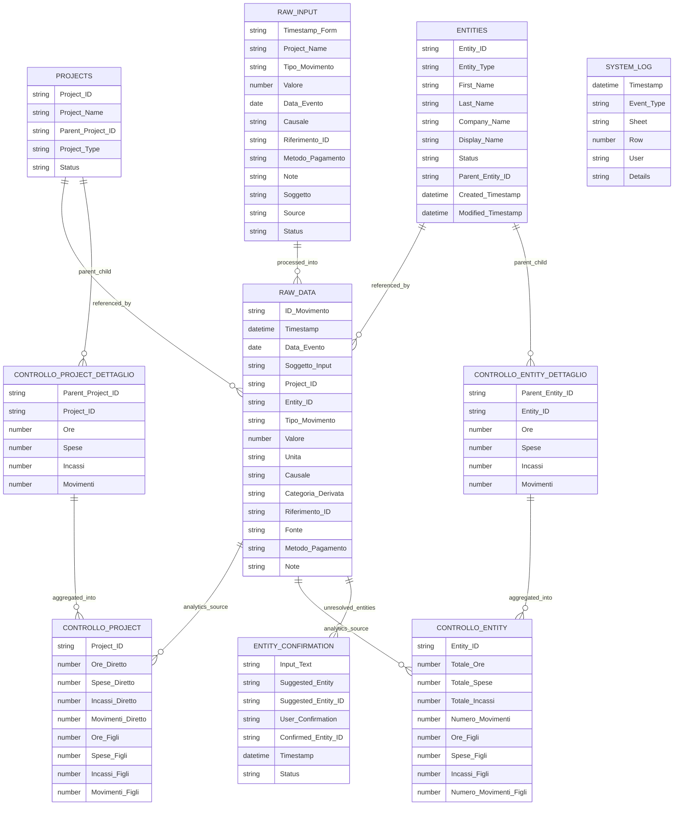

# LOGOS_DATABASE_DIAGRAM.md

## System: LOGOS Event Ledger Architecture

This document describes the relational and logical structure of the LOGOS system.
The diagram reflects the runtime architecture implemented in Google Sheets and Apps Script.

---

## High Level Pipeline

RAW_INPUT → Processor.gs → RAW_DATA → Analytics / Dimensions

---

## Mermaid ER Diagram

